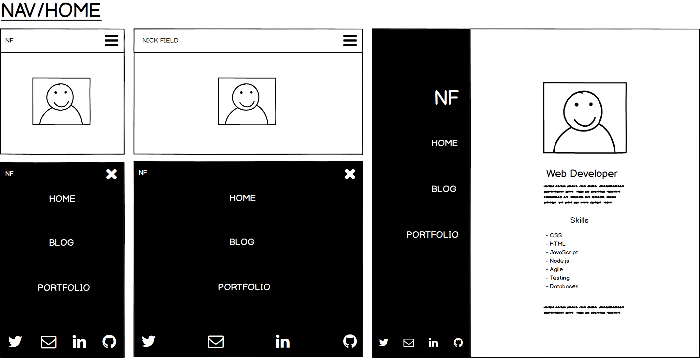
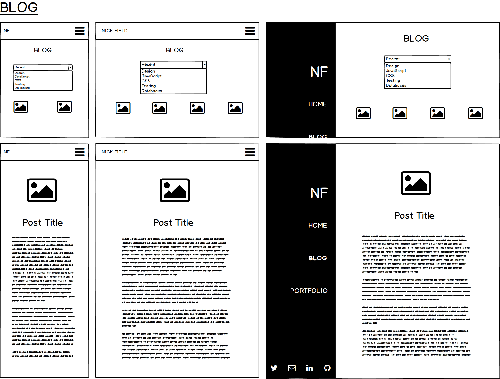
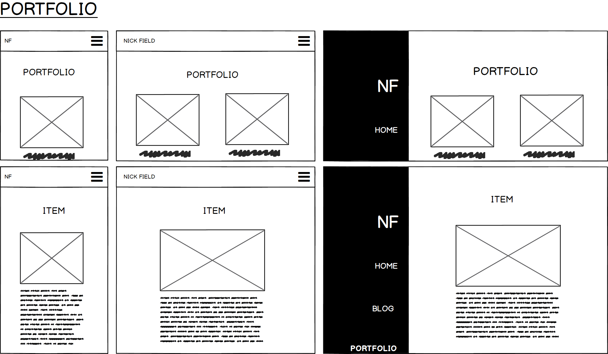
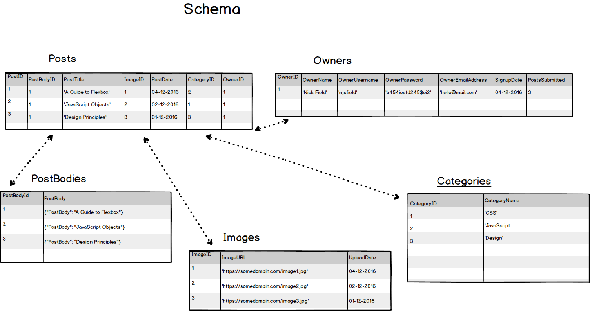

# Description
A personal website to host a biography, a blog, and personal/professional projects.
Users can view blog posts and filter them by category.
The owner can log in, edit/create/delete/hide blog and portfolio posts.

# Technologies
Node.js  
Hapi.js
Bcrypt
Handlebars
Postgres

# Mockups

### Home/Nav

### Blog

### Portfolio

### Create Post Flow


# Schema


### Initialise DB
```sql
CREATE TABLE Posts (
  PostID SERIAL PRIMARY KEY NOT NULL,
  PostTitle VARCHAR(1000) NOT NULL,
  ImageID INTEGER,
  CreationDate DATE NOT NULL,
  ModifiedDate DATE NOT NULL,
  Live BOOLEAN,
  CategoryID INTEGER,
  OwnerID INTEGER NOT NULL
);

CREATE TABLE PostBodies (
  PostID INT REFERENCES Posts ON DELETE CASCADE,
  PostBody Text,
  PRIMARY KEY (PostID)
);

CREATE TABLE Owners (
  OwnerID SERIAL PRIMARY KEY NOT NULL,
  OwnerName VARCHAR(100) NOT NULL,
  OwnerUsername VARCHAR(100) UNIQUE NOT NULL,
  OwnerPassword VARCHAR(100) NOT NULL,
  OwnerEmailAddress VARCHAR(100) NOT NULL,
  SignupDate DATE NOT NULL,
  PostsSubmitted INTEGER
);

INSERT INTO Owners (OwnerName, OwnerUsername, OwnerPassword, OwnerEmailAddress, SignupDate, PostsSubmitted) VALUES
('Nick Field', 'njsfield', 'Badger', 'heyimnick@live.com', CURRENT_DATE, 0);

CREATE TABLE Categories (
  CategoryID SERIAL PRIMARY KEY NOT NULL,
  CategoryName VARCHAR(100) NOT NULL
);

INSERT INTO Categories (CategoryName) VALUES
('CSS'),
('JavaScript'),
('Design')
('Portfolio');

CREATE TABLE Images (
  ImageID SERIAL PRIMARY KEY NOT NULL,
  ImageURL VARCHAR(500) NOT NULL,
  ImageTitle VARCHAR(500),
  UploadDate DATE NOT NULL
);

INSERT INTO Images (ImageURL, UploadDate) VALUES
('https://github.com/FAC9/the-badgerer/blob/master/public/images/badger1.jpg' 'A Badger', CURRENT_DATE),
('https://github.com/FAC9/the-badgerer/blob/master/public/images/badger2.jpg', 'Another Badger', CURRENT_DATE),
('https://github.com/FAC9/the-badgerer/blob/master/public/images/badger3.jpg', 'A third Badger', CURRENT_DATE);

```
### Insert Post Query
```sql
BEGIN TRANSACTION;
  INSERT INTO Posts (PostTitle, ImageID, CreationDate, ModifiedDate, Live, CategoryID, OwnerID)
    VALUES ('A Guide To Flexbox' , 1 , CURRENT_DATE, CURRENT_DATE, TRUE, 1, 1);
  INSERT INTO PostBodies (PostId, PostBody)
    VALUES ((SELECT MAX(PostID) FROM Posts), 'Flexbox is simply incredible');
COMMIT;
```

### Return Whole Post Query
```sql
SELECT * FROM Posts INNER JOIN PostBodies ON PostBodies.PostID = 1;
```
### Update Post
```sql
BEGIN TRANSACTION;
  Update Posts
    SET PostTitle = 'CSS is super', ImageID = 2, ModifiedDate = CURRENT_DATE, CategoryID = 1
    WHERE PostID = 1 AND OwnerID IN
      (SELECT OwnerID FROM Owners
        WHERE Owners.OwnerUsername = 'njsfield' AND
              Owners.OwnerPassword = 'Badger');
  Update PostBodies SET PostBody = 'I just love it so much'
    WHERE PostID = 1;
COMMIT;
```
### Delete Post
```sql
DELETE FROM Posts WHERE PostId = 1 AND OwnerID IN
  (SELECT OwnerID FROM Owners
    WHERE Owners.OwnerUsername = 'njsfield' AND
          Owners.OwnerPassword = 'Badger');
```
### Hide Post
```sql
Update Posts SET Live = FALSE WHERE PostID = 1;
```
### Show Post
```sql
Update Posts SET Live = TRUE WHERE PostID = 1;
```
### Return Posts By Category
```sql
SELECT * FROM Posts WHERE Posts.CategoryID IN
(SELECT CategoryId FROM Categories WHERE Categories.CategoryName = 'CSS');
```

# Routes
### Public
/home [GET]  
/blog (queries: filterby='CSS/JavaScript/Design' ) [GET]  
/blog/id [GET]  
/portfolio [GET]   
/portfolio/id [GET]  

### Owner
/login [POST]    
/logout [GET]  
/compose [GET, POST]  
/edit/id [GET,PUT]  
/delete/id [DELETE]   
/hide/id [PUT]  
/show/id [PUT]  
/images [GET, POST]


# HBS

## Views

home.hbs  
blog.hbs  
post.hbs  
portfolio.hbs  
edit.hbs  
compose.hbs  
login.hbs  

## Partials

posts.hbs  
portfolioitems.hbs  

## Layout

default.hbs  
