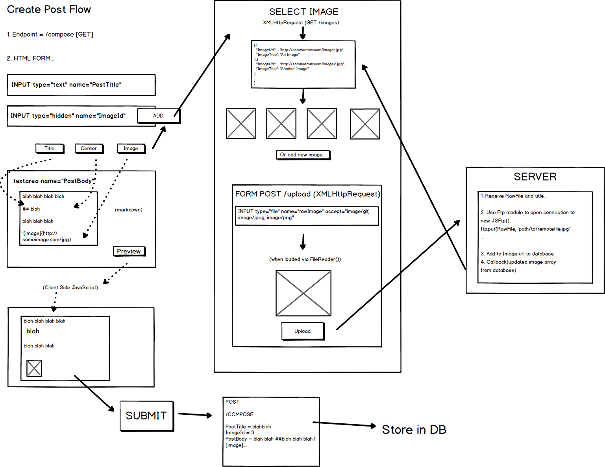

# Description
A personal website to host a biography, a blog, and personal/professional projects.
Users can view blog posts and filter them by category.
The owner can log in, edit/create/delete/hide blog and portfolio posts.

# Technologies
Node.js  
Hapi.js
Bcrypt
Handlebars
Postgres

# Mockups

### Home/Nav

### Blog

### Portfolio

### Create Post Flow


# Schema


### Insert Post Query
```sql
BEGIN TRANSACTION;
  INSERT INTO posts (posttitle, imageid, creationdate, modifieddate, live, categoryid, ownerid)
    VALUES ('A Guide To Flexbox' , 1 , CURRENT_DATE, CURRENT_DATE, TRUE, 1, 1);
  INSERT INTO postbodies (postid, postbody)
    VALUES ((SELECT MAX(postid) FROM posts), 'Flexbox is simply incredible');
COMMIT;
```

### Return Whole Post Query
```sql
SELECT * FROM posts INNER JOIN postbodies ON postbodies.postid = 1;
```
### Update Post
```sql
BEGIN TRANSACTION;
  Update posts
    SET posttitle = 'CSS is super', imageid = 2, modifieddate = CURRENT_DATE, categoryid = 1
    WHERE postid = 1 AND ownerid IN
      (SELECT ownerid FROM owners
        WHERE owners.ownerusername = 'njsfield' AND
              owners.ownerpassword = '$2a$10$IJETvwsaxVYjxPDeRarqjOrYZQWFQCgQp6VohxK0N1JbBYxRpIz7e');
  Update postbodies SET postbody = 'I just love it so much'
    WHERE postid = 1;
COMMIT;
```
### Delete Post
```sql
DELETE FROM posts WHERE postid = 1 AND ownerid IN
  (SELECT ownerid FROM owners
    WHERE owners.ownerusername = 'njsfield' AND
          owners.ownerpassword = '$2a$10$IJETvwsaxVYjxPDeRarqjOrYZQWFQCgQp6VohxK0N1JbBYxRpIz7e');
```
### Hide Post
```sql
Update posts SET live = FALSE WHERE postid = 1;
```
### Show Post
```sql
Update posts SET live = TRUE WHERE postid = 1;
```
### Return Posts By Category
```sql
SELECT * FROM posts WHERE posts.categoryid IN
(SELECT categoryid FROM categories WHERE categories.categoryname = 'CSS');
```

# Routes
### Public
/home [GET]  
/blog (queries: filterby='CSS/JavaScript/Design' ) [GET]  
/blog/id [GET]  
/portfolio [GET]   
/portfolio/id [GET]  

### Owner
/login [GET, POST]    
/logout [GET]  
/compose [GET, POST]  
/edit/id [GET,PUT]  
/delete/id [DELETE]   
/hide/id [PUT]  
/show/id [PUT]  
/images [GET, POST]


# HBS

## Views

home.hbs  
blog.hbs  
post.hbs  
portfolio.hbs  
edit.hbs  
compose.hbs  
login.hbs  

## Partials

posts.hbs  
header.hbs
portfolioitems.hbs  

## Layout

default.hbs  
