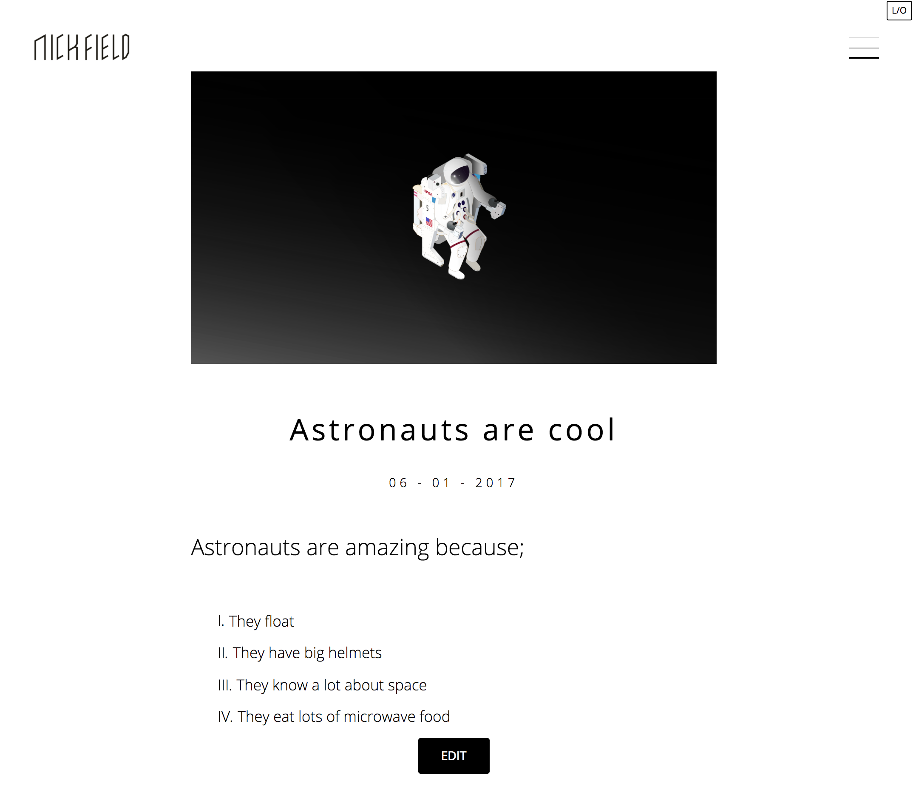
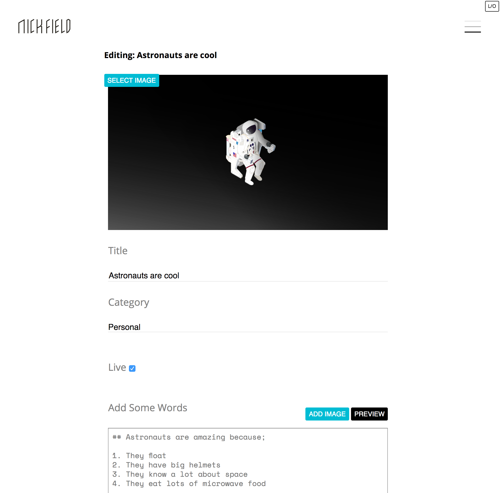
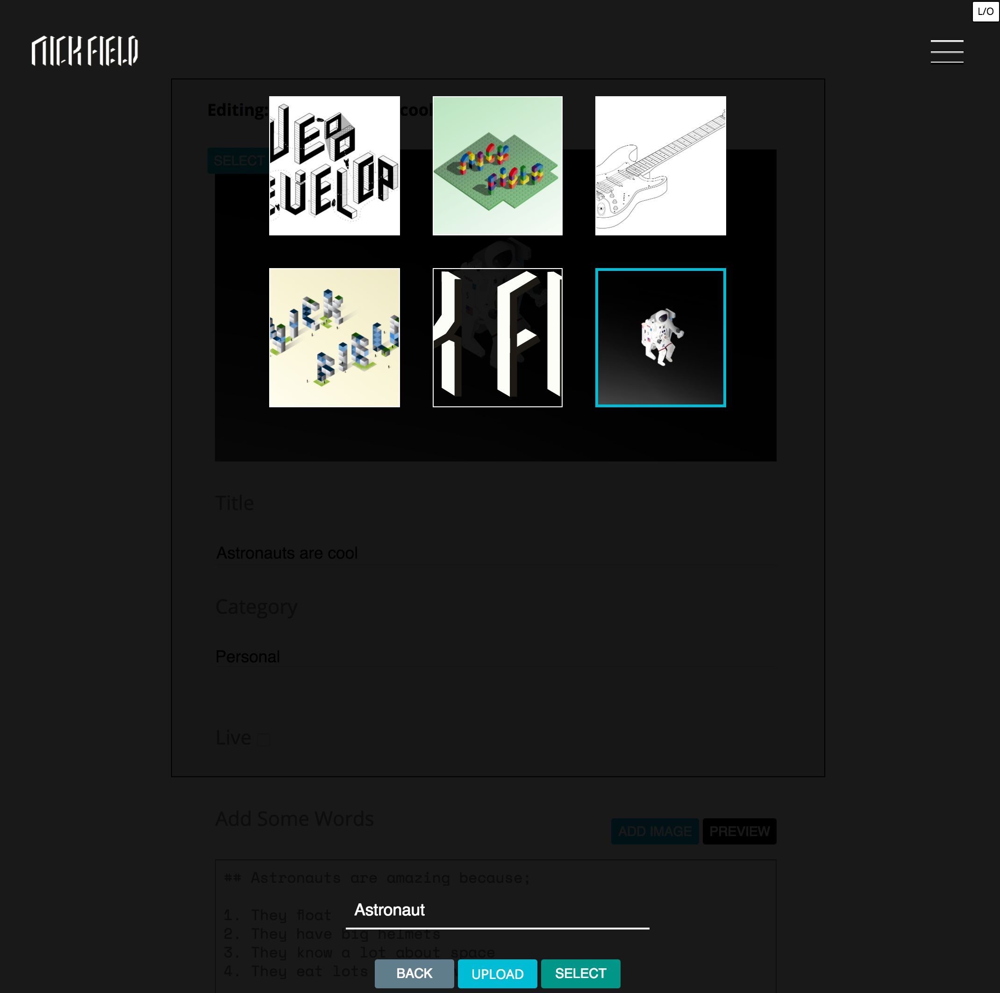
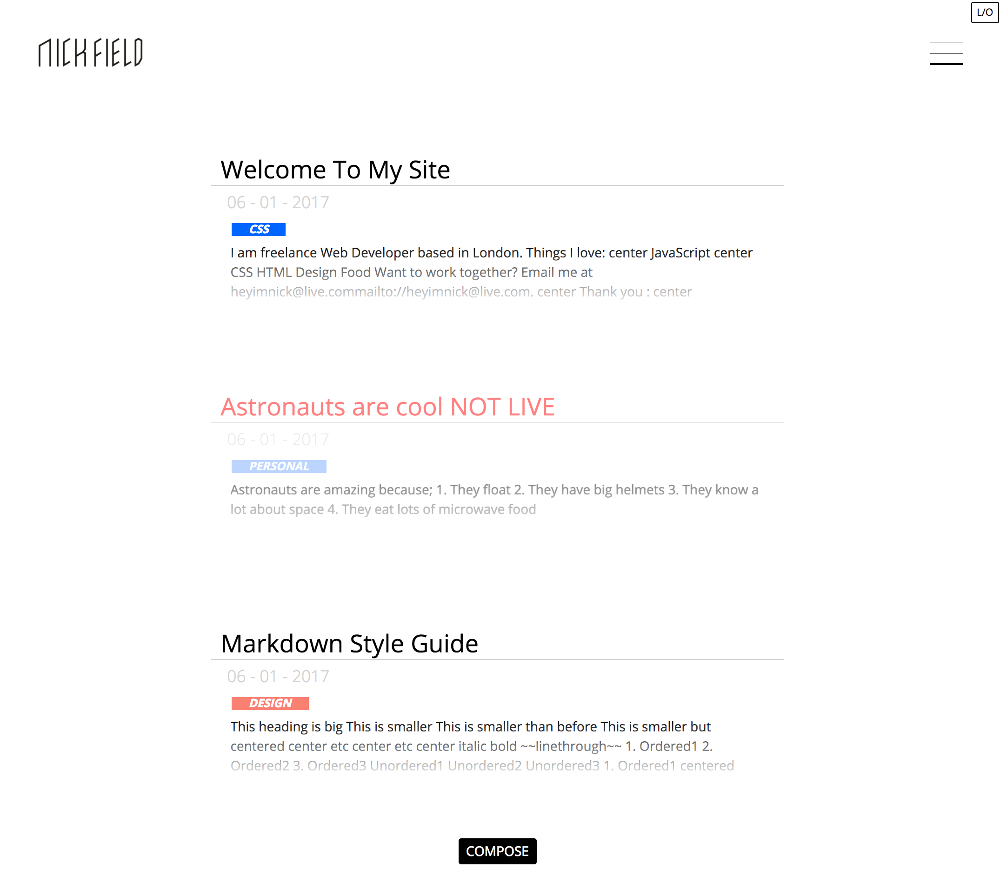
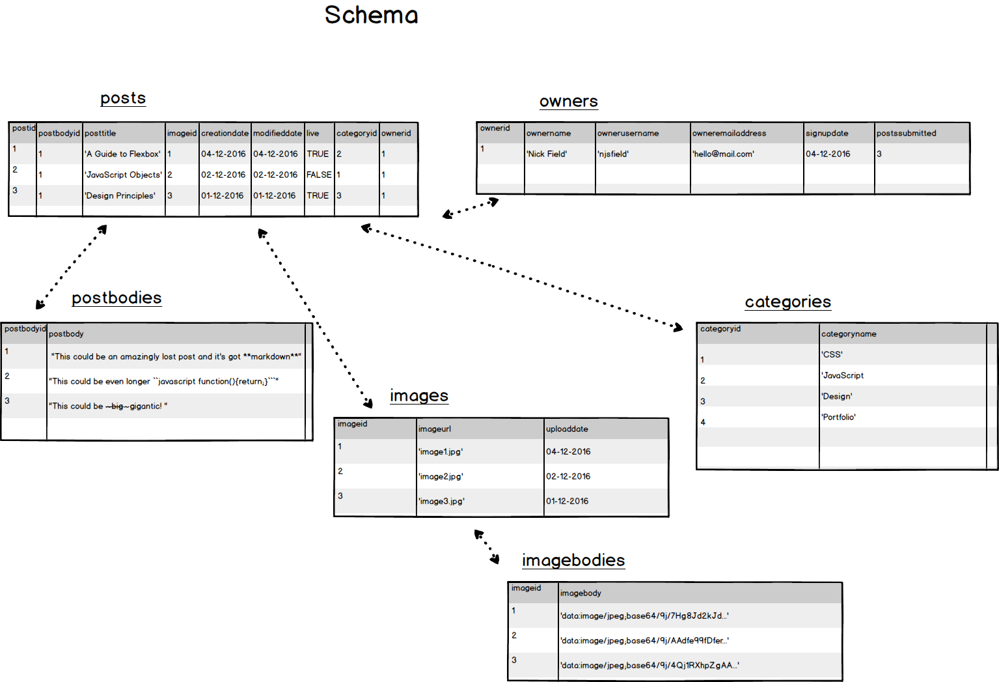

# Description
A personal website to host a biography, a blog, and personal/professional projects. Includes a content manage system to add/update/update posts from a database, as well as add/update/delete images. See [mockups](./docs/mockups/) for original designs.

The live site can be viewed here

# Technologies
- Node.js  
- Hapi.js
- Sass
- PostCSS
- Webpack
- ES6
- Handlebars
- Postgres

# Testing Tools
- Tape
- Istanbul
- Codecov

# Admin Screenshots

For logged in users, they can see an edit button below their posts-

When the user hits edit, they're taken to a restricted edit page for the post-

Here they can update the main image, edit the title, category, preview the markdown text (and embed images in the text), as well as submit changes and delete the post if they wish. If they choose to select an image;

They'll be shown an overlay of previously uploaded images, where they can upload a new image, edit the image title, delete an image, or go back.

If they choose to make the post hidden (so only they can view it) they can deselect the 'Live' button. Then when viewing the post snippet in the blog view they'll be warned that it's not live-

# Database

Postgres is used to store the database, with queries passed to it via the npm module [pg](https://www.npmjs.com/package/pg). Features of the schema include-
- Posts are split into 'posts' and 'postbodies' tables. Post bodies can be quite lengthy, and often when querying posts only meta information is needed. So post bodies are stored in their own table, queries are used to update/insert both at the same time, and when a post gets deleted the postbody is automatically deleted (`postid INT REFERENCES posts ON DELETE CASCADE`)
- Images are also split into 'images' and 'imagebodies'. The image bodies are stored as blobs, and the server deals with the logic of extracting the data and converting it to a buffer when sending to the client.
- Inner Joins on other tables are used to get information about a post (including the postbody, category, ownername), but Left Joins are used on the image table (as sometimes an image used for a post will be deleted, so the post can still queried if the image id is no longer used)
